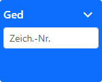
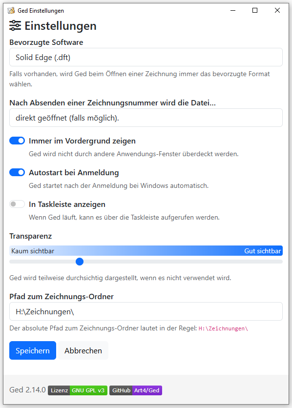
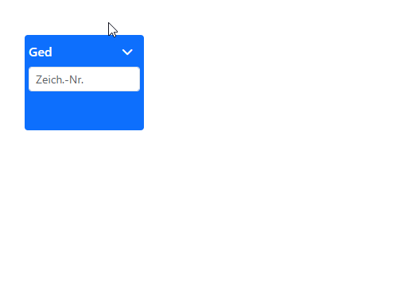

<!-- @@@title:Readme@@@ -->

# Ged


[](https://github.com/Art4/Ged/releases)
[](LICENSE)
[](https://github.com/Art4/Ged)
[](https://github.com/Art4/Ged/actions)

Ged ist ein Gadget für Windows, das Zeichnugen schnell öffnen lassen kann und weitere Funktionen zur Verwaltung von Zeichnungen bereitstellt.

Die Änderungen des Projekts können im [Changelog](CHANGELOG.md) nachverfolgt werden.

Der Quellcode ist auf [Github](https://github.com/Art4/Ged) zu finden und unterliegt der [GPL3](LICENSE).

## Features

- ⚡ Schnelles Öffnen von Zeichnungen anhand der Zeichnungsnummer mit automatischer Berücksichtigung der letzten Zeichnungsrevision
- 📋 Schnelles Auflisten aller vorhandener Zeichnungsdateien
- 🔍 Schnelles Öffnen einer Zeichnung mit bestimmten Revisionsstand und/oder Dateiformat
- 📂 Schnelles Öffnen der 3D-Daten einer Zeichnung
- 🧹 Automatische Bereinigung nach Erstellung einer Zeichnungsrevision
- 🔒 Setzen und Entfenen des Schreibschutzes bei einer Zeichnungdatei

## Bedienung

Ged ist eine kleine Anwendung, die primär über das Suchfeld bedient wird. Eine Suche bzw. Befehl wird mit der `Enter`-Taste abgesendet.



Über einen Pfeil-Button wird ein Menü geöffnet, das die Optionen "App schließen", "Hilfe" und "Einstellungen" zeigt.


Über die Einstellungen wird das Verhalten und Aussehen von Ged konfiguriert.



Ged kann per Drag-and-Drop verschoben werden.



## Anwendung

**Neu ab Version 2.7.0**: Die Zeichnungsnummer kann auch im gebräuchlicheren Format mit Schrägstrichen angegeben werden:

```
<Zeichnungsnummer>[/<Revision>[/<Format>]][.<Endung>] [<Aktion>]
```

Das Blattformat wird hierbei immer ignoriert und kann auch weggelassen werden.

> Aus Kompatibilitätsgründen versteht Ged auch weiterhin die ursprüngliche Eingabe in dieser Form:
>
> ```
> <Zeichnungsnummer>[-r<Revision>][.<Endung>] [<Aktion>]
> ```


Um die Eingabe abzusenden, kann die `Enter`-Taste gedrückt werden.

### Zeichnungsnummer

Die Angabe eine Zeichnungsnummer ist immer erforderlich und muss eine 5-stellige Zahl sein.

#### Beispiel

```
12345
```

### Revision

Ged versucht immer die letzte Revision einer Zeichnung zu finden. Mit der Angabe der Revision kann nach einer expliziten Revision gesucht werden.

Die Revision ist eine einstellige Zahl zwischen `0` und `9` oder ein Großbuchstabe von `A` bis `Z`. Die Angabe der Revision erfolgt nach der Zeichnungsnummer und wird mit `/` (oder auch `-r`) abgetrennt.

#### Beispiele

```
12345/1
12345/B
12345-r1
12345-rB
```

### Endung

In den Optionen von Ged ist definiert, nach welcher Dateiendung gesucht werden soll. Soll von dieser Einstellung abgewichen werden, kann die Dateiendung mit `.<Dateiendung>` explizit angegeben werden.

Die Dateiendung ist eine Zeichenkette mit mindestens einem Zeichen. Die am häufigsten verwendeten Dateiendungen sind `pdf` für PDF-Dateien, `dft` für Solid Edge Zeichnugen oder `dwg` für AutoCAD-Dateien.

#### Beispiele

```
12345.pdf
12345.tiff
```

Soll zusätzlich zur Dateiendung eine bestimmte Revision gesucht werden, so muss die Revision vor der Dateiendung angegeben werden.

#### Beispiele

```
12345/1.pdf
12345-r0.tiff
```

### Aktion

Mit einer Aktion kann bestimmt werden, wie mit einer gefundenen Zeichnung verfahren wird. Wird keine Aktion angegeben, wird die Standardaktion `o` (für 'open') angenommen.

**Neu ab Version 2.10.0**: Die Standardaktion kann in den Einstellungen geändert werden. Zur Auswahl stehen `Datei direkt öffnen (falls möglich)` (entspricht Aktion `o`) oder `Datei im Windows Explorer anzeigen` (entspricht Aktion `i`).

Die Aktion ist eine Zeichenkette von meist einem Zeichen. Sie wird mit einem ` ` (Leerzeichen) getrennt nach der Angabe der Zeichnungsnummer angegeben. Eine Liste möglicher Aktionen ist weiter unten zu finden.

#### Beispiel

```
12345 o
```

Sollen zusätzlich noch die Dateiendung und/oder Revision bestimmt werden, müssen diese wie oben beschrieben nach der Zeichnungsnummer angegeben werden.

#### Beispiele

```
12345.pdf o
12345/1 o
12345/1.pdf o
```

## Aktionen

### `o` - open

Sucht nach der neusten Revison einer Zeichnung und öffnet diese. Wenn die Datei nicht gefunden wurde, wird der Explorer an der Stelle geöffnet, an der die eingegebene Zeichnungsnummer erwartet wird und selektiert die am besten passenste Datei.

Die Aktion `open` ist der Standard. Wird keine Aktion angegeben, wird die gefundene Zeichnung automatisch geöffnet.

#### Beispiel

```
12345 o
12345
```

Wurde zu einer Zeichnungsnummer keine passende Datei gefunden, dann wird der Windows Explorer geöffnet, damit der Anwender eine Übersicht über die verfügbaren Zeichnungen erhält. Siehe auch die Aktion `i`.

### `e` oder `3d` - 3D-Ordner öffnen

Diese Aktion öffnet den 3D-Ordner einer Zeichnung. Wenn der Ordner nicht existiert, wird die Meldung `Der Ordner <Zeichnungsnummer>_3D existiert nicht` ausgegeben.

#### Beispiel

```
12345 e
12345 3d
```

### `i` - index

Diese Aktion öffnet den Windows Explorer an der Stelle, an der die eingegebene Zeichnungsnummer erwartet wird und selektiert die am besten passenste Datei. So kann man sich einen schnellen Überblick über die vorhandenen Dateien im Zeichnungs-Archiv verschaffen.

#### Beispiel

```
12345 i
```

### `+` oder `a` - erweiterte Suche

Sucht nach wie `o` der neusten Revison einer Zeichnung und öffnet diese. Wenn die Datei nicht gefunden wurde, wird zusätzlich im dazugehörigen 3D-Ordner nach der Datei gesucht. Wenn sich die Datei im 3D-Ordner befindet, wird die Meldung `<Zeichnungsnummer>_3D\<Zeichnungsnummer>-R0.dft wird geöffnet` ausgegeben.

#### Beispiel

```
12345 +
12345 a
```

### `s` - Scheibschutz setzen

Setzt den Schreibschutz bei der gefundenen Datei und gibt die Meldung `<Zeichnungsnummer>.dft ist schreibgeschützt` aus.

#### Beispiel

```
12345 s
```

### `f` - Scheibschutz aufheben

Hebt den Schreibschutz bei der gefundenen Datei und gibt die Meldung `<Zeichnungsnummer>.dft ist beschreibbar` aus.

#### Beispiel

```
12345 f
```

### `c` - Dateien bereinigen

Setzt bei der vorherige Revision der gesuchten Zeichnung die DFT-Datei auf Schreibschutz und löscht andere Dateiformate der selben Revision. Vor dem Löschen jeder Datei erscheint ein Warnhinweis mit dem zu löschenden Dateinamen, der erst vom Anwender bestätigt werden muss. Bricht der Anwender das Löschen ab, wird nur der Schreibschutz bei der DFT-Datei gesetzt.

#### Beispiel

Angenommen, es existieren die folgenden Dateien:

- 12345-R0.dft
- 12345-R0.pdf
- 12345-R1.dft
- 12345-R1.pdf
- 12345-R1.stp
- 12345-R2.dft

Der Aufruf von

```
12345 c
```

löscht nach Rückfrage die Dateien `12345-R1.pdf` und `12345-R1.stp` und aktiviert bei der Datei `12345-R1.dft` den Schreibschutz. Die vorhergehenden Revisionen werden nicht verändert. Die Dateien sehen jetzt so aus:

- 12345-R0.dft
- 12345-R0.pdf
- 12345-R1.dft (schreibgeschützt)
- 12345-R2.dft

Sollen jetzt auch die Dateien der Revision 0 bereinigt werden, muss die Aktion mit der Revision 1 aufgerufen werden.

```
12345/1 c
```

Die Dateien sehen dann so aus:

- 12345-R0.dft (schreibgeschützt)
- 12345-R1.dft (schreibgeschützt)
- 12345-R2.dft

## Logs

Ged erstellt Log-Dateien, die bei einem Fehlerfall helfen können, die Ursache zu finden oder den Fehler zu rekonstruieren.

Die Log-Dateien liegen unter Windows im Verzeichnis `%APPDATA%\Ged\logs\`.

## Technische Details

Ged v1 war als Windows Gadget umgesetzt, welche seit Windows 8 nicht mehr unterstützt werden. Daher wurde Ged auf Basis von [Electron](https://electronjs.org/) komplett neu geschrieben.

Die folgenden Informationen beziehen sich auf die Entwicklung von Electron.

### Anforderungen

- node.js 20
- npm

### Installation

```shell
npm install
npm run webpack
```

### Starten

```shell
npm start
```

### Deployment

```shell
npm run deploy
```

Beim Deployment wird im Ordner `dist/` eine EXE Datei erstellt, die unter Windows installiert werden kann.

### Publish

Um eine neue Version [auf Github](https://github.com/Art4/Ged) zu veröffentlichen, wird ein Github Token benötigt, das als ENV Variable übergeben wird.

```shell
env GH_TOKEN=<github token> npm run publish
```

Dabei wird im Ordner `dist/` eine EXE Datei erstellt, und auf Github eine Release-Draft erstellt. Dieser Release-Draft muss anschließend auf Github veröffentlicht/freigeschaltet werden.

Beim Starten von Ged wird automatisch überprüft, ob eine neue Version vorliegt. Wenn ja, wird diese heruntergeladen und nach Beenden von Ged automatisch installiert.
